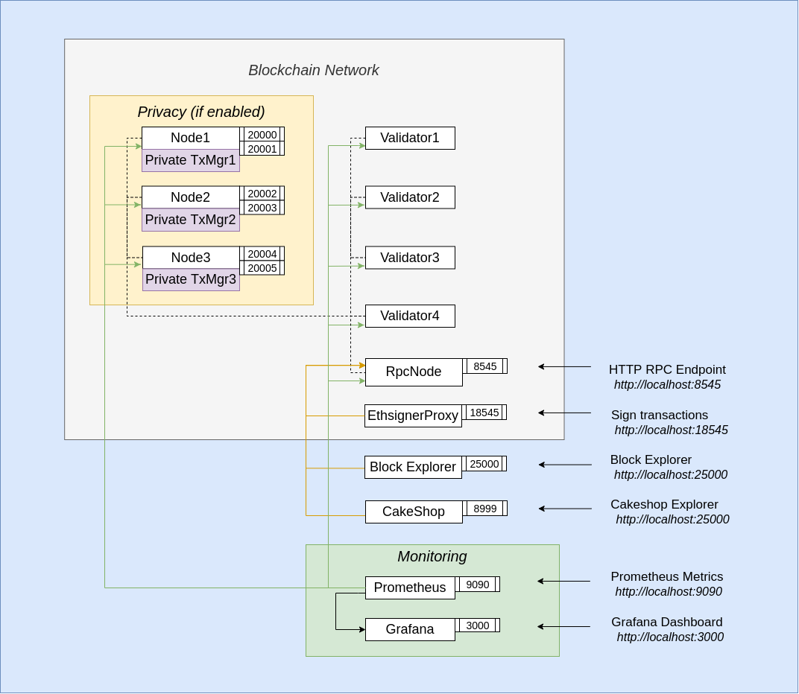

# besu network quickstart

## Table of Contents

- [besu network quickstart](#besu-network-quickstart)
  - [Table of Contents](#table-of-contents)
  - [Prerequisites](#prerequisites)
  - [Usage](#usage)
  - [Dev Network Setups](#dev-network-setups)
    - [i. POA Network ](#i-poa-network-)
  - [Moving to production](#moving-to-production)

## Prerequisites

To run these tutorials, you must have the following installed:

- [Docker and Docker-compose](https://docs.docker.com/compose/install/) v2 or higher

| ⚠️ **Note**: If on MacOS or Windows, please ensure that you allow docker to use upto 4G of memory or 6G if running Privacy examples under the _Resources_ section. The [Docker for Mac](https://docs.docker.com/docker-for-mac/) and [Docker Desktop](https://docs.docker.com/docker-for-windows/) sites have details on how to do this at the "Resources" heading |
| ------------------------------------------------------------------------------------------------------------------------------------------------------------------------------------------------------------------------------------------------------------------------------------------------------------------------------------------------------------------ |

| ⚠️ **Note**: This has only been tested on Windows 10 Build 18362 and Docker >= 17.12.2 |
| -------------------------------------------------------------------------------------- |

- On Windows ensure that the drive that this repo is cloned onto is a "Shared Drive" with Docker Desktop
- On Windows we recommend running all commands from GitBash
- [Nodejs](https://nodejs.org/en/download/) or [Yarn](https://yarnpkg.com/cli/node)

## Usage

Change directory to the artifacts folder:

`cd quorum-test-network` (default folder location)

**To start services and the network:**

`./run.sh` starts all the docker containers

**To stop services :**

`./stop.sh` stops the entire network, and you can resume where it left off with `./resume.sh`

`./remove.sh ` will first stop and then remove all containers and images

## Dev Network Setups

All our documentation can be found on the [Besu documentation site](https://besu.hyperledger.org/Tutorials/Examples/Private-Network-Example/).

Each quickstart setup is comprised of 4 validators, one RPC node and some monitoring tools like:

- [Alethio Lite Explorer](https://besu.hyperledger.org/en/stable/HowTo/Deploy/Lite-Block-Explorer/) to explore blockchain data at the block, transaction, and account level
- [Metrics monitoring](https://besu.hyperledger.org/en/stable/HowTo/Monitor/Metrics/) via Prometheus and Grafana to give you insights into how the chain is progressing (only with Besu based Quorum)
- Optional [logs monitoring](https://besu.hyperledger.org/en/latest/HowTo/Monitor/Elastic-Stack/) to give you real time logs of the nodes. This feature is enabled with a `-e` flag when starting the sample network

The overall architecture diagrams to visually show components of the blockchain networks is shown below.
**Consensus Algorithm**: The Besu based Quorum variant uses the `IBFT2` consensus mechanism.

### i. POA Network 

This is the simplest of the networks available and will spin up a blockchain network comprising 4 validators and 1 RPC. To view the progress
of the network, the Quorum block explorer can be used and is available on `http://localhost:25000`.
Hyperledger Besu based Quorum also deploys monitoring solutions.
You can choose to make metrics monitoring via Prometheus available on `http://localhost:9090`,
paired with Grafana with custom dashboards available on `http://localhost:3000`.
You can also use Splunk to see all logs, traces and metrics available at `http://localhost:8000` (with the credentials admin/quickstart).

Essentially you get everything in the architecture diagram above, bar the yellow privacy block

Use cases:

- you are learning about how Ethereum works
- you are looking to create a Mainnet or Ropsten node but want to see how it works on a smaller scale
- you are a DApp Developer looking for a robust, simple network to use as an experimental testing ground for POCs.

## Moving to production

When you are ready to move to production, please create new keys for your nodes using the
[Quorum Genesis Tool](https://www.npmjs.com/package/quorum-genesis-tool) and read through the the
[Besu documentation](https://besu.hyperledger.org/en/latest/HowTo/Deploy/Cloud/)
